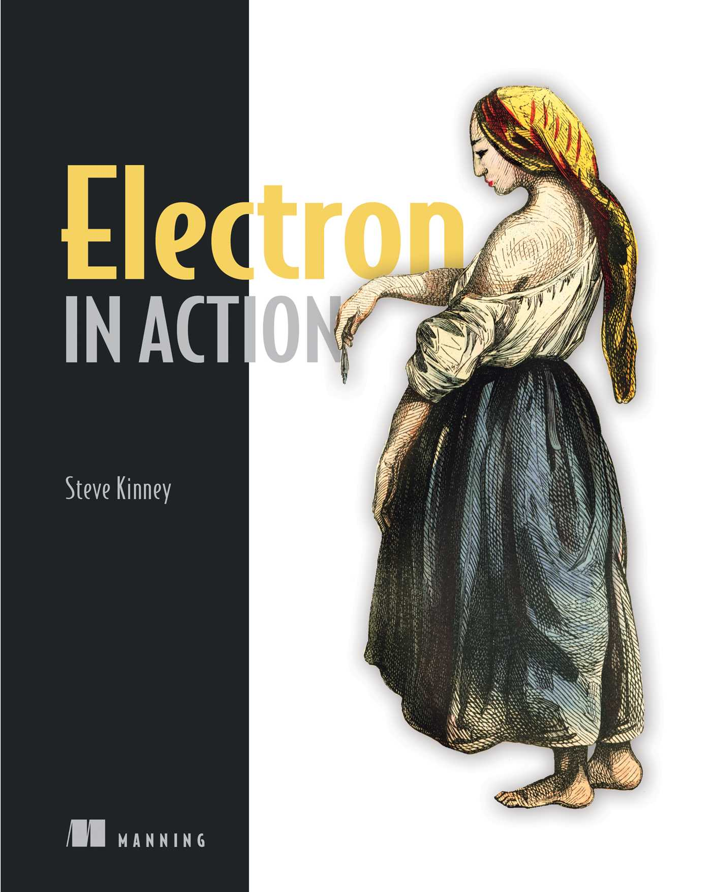

firesale code in firesale folder, and other app follow the rule.

This repository contains 2023 updated code for **Electron in Action**, written by **Steve Kinney** and published by **Manning** in **2018**. It is a byproduct of my experience with the book(not finished), where I found that most of the code could not run on the latest version of Electron.

I will adapt the code to my dev configuration, which uses node~=18 and Electron~=25.

Most of the code that involves ipc needs to be refactored because of the latest version of Electron's default context isolation and sandbox mode in the renderer process. However, I will not break the default configuration to practice Electron's security code.

Before chapter 4, I am not ready to open the repository, so the commit history before that is a little messy. Check the tag when you read a specific chapter.

I read Electron's official tutorial before I read the book, which helped me grasp a clearer big picture, and made it easier for me to refactor the code. Once again, ipc is an important part of the documentation, and it is recommended to read it if you want to use the latest version of Electron smoothly."

Update:

Chapter 11: replace electron-rebuild with Forge + webpack plugin + react template.

Chapter 12: sqllite code move to main proces， indexedDB code move to
renderer process.

Chapter 13: replace spectron, mocha with Playwright.